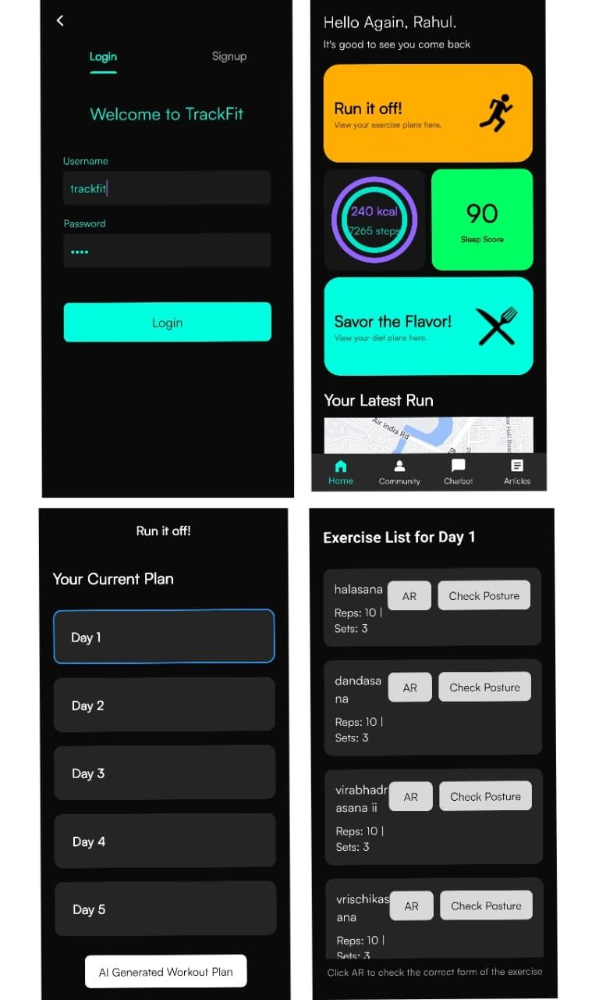
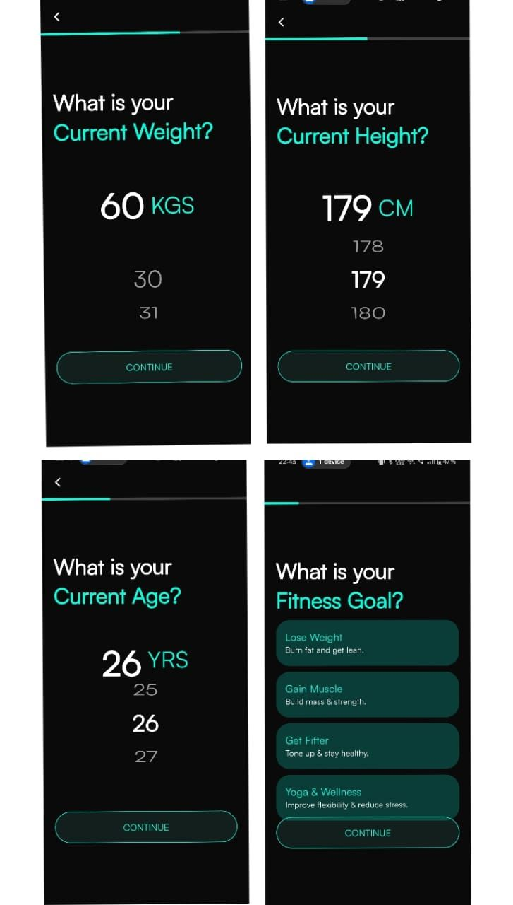
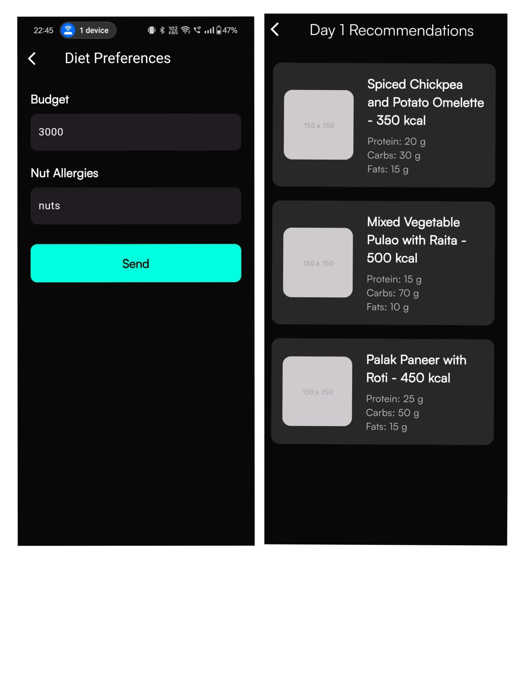
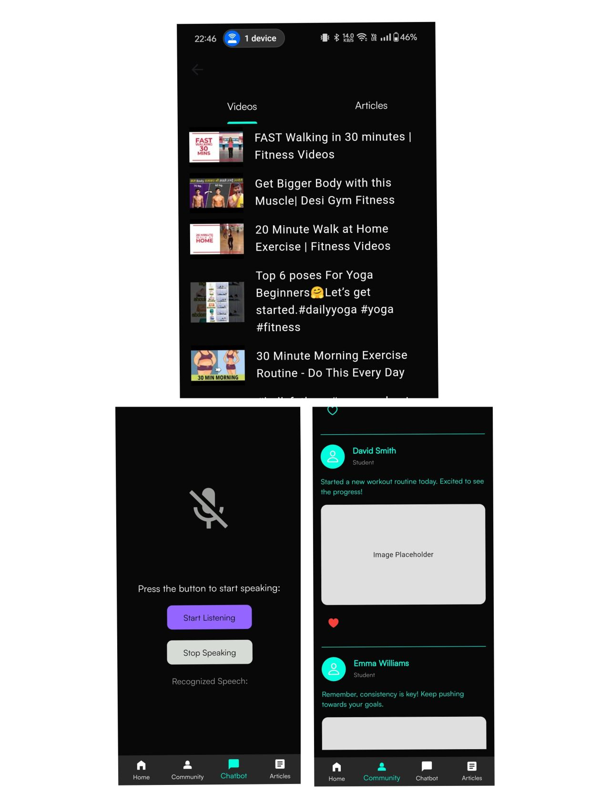

# 🏋️ TrackFit - Your Personal Fitness & Diet Companion 📲

Welcome to **TrackFit**, an innovative fitness and diet recommendation app that uses AR technology, AI-driven recommendations, and real-time tracking to empower your health journey! Whether you're here to follow a personalized diet, improve your exercise form, or monitor your fitness, TrackFit has everything you need.

---

## 🌟 Features

### 1. 🥗 AI-Powered Diet Recommendations
   - **Personalized Weekly Plans**: TrackFit's GAN model analyzes your profile and BMI to create custom meal plans for the entire week.
   - **Recipe Suggestions**: Discover new recipes that align with your fitness goals.
   - **Calorie Tracker**: Easily monitor daily calorie intake to stay on track.

### 2. 🏃 AR-Enhanced Fitness Exercises
   - **AR Workout Learning**: Watch and follow 3D models of recommended exercises in AR, right in your space.
   - **Posture Correction**: Using OpenCV, TrackFit monitors and corrects your posture in real-time to improve your form.

### 3. 🤖 Voice-Controlled Fitness Bot
   - **Hands-Free Guidance**: Just ask the voice bot for personalized fitness tips, track your progress, or learn about new exercises.
   - **Real-Time Updates**: Get reminders, motivational quotes, and answers to common fitness questions.

### 4. 📊 Google Fit-Integrated Dashboard
   - **Health Tracking**: Seamlessly connect to Google Fit and monitor all your vital stats, including heart rate, steps, and more.
   - **Visual Insights**: Easily view your progress with interactive graphs and reports.

---

## 🎨 UI Highlights

### 🧑‍💻 Intuitive Dashboard
   - **Data At A Glance**: Get a quick overview of calories, workouts, and more.
   - **User-Friendly Navigation**: Smooth, organized, and ready for quick access to all features.

### 🏞️ Immersive AR View
   - **3D Exercise Models**: Watch recommended exercises in AR, interact with 3D models, and understand each movement better.

### 📈 Progress Visualization
   - **Graphs & Insights**: Track your fitness over time with clear graphs and in-depth insights to keep you motivated.

---

## 🖼️ Screenshots

| Feature        | Image                                                                 |
|----------------|----------------------------------------------------------------------|
| **Dashboard**  |                    |
| **Diet Plans** |                    |
| **AR Workout** |                    |
| **Progress**   |                    |

---

## 🚀 Installation

1. Clone the repo:
   ```bash
   git clone https://github.com/yourusername/trackfit.git
   cd trackfit
   ```
2. Install dependencies:
   ```bash
   flutter pub get
   ```
3. Run the app:
   ```bash
   flutter run
   ```
4. Replace the **ngrok API URL** in the app code with your own server URL.  
   Backend repository: [TrackFit Backend](https://github.com/Pranav-stac/TrackfitBackend)

---

## 🤝 Contributing

Contributions are welcome! Feel free to submit issues, fork the repo, and make a pull request.

---

## 📞 Contact

Have questions or feedback? Reach out at [your.email@example.com](mailto:your.email@example.com).

---

## 🏷️ Tags

`flutter` `AR` `AI` `GAN` `OpenCV` `exercise tracking` `diet app` `fitness bot` `Google Fit integration` `real-time tracking`  
`flutter AR` `AR in Flutter` `personalized diet plans` `posture correction` `voice bot` `AI fitness assistant`  
`calorie tracking` `health tracking` `AR workout tutorials` `machine learning in fitness` `3D models`  
`GAN for diet planning` `OpenCV posture analysis`

---

**TrackFit**—Your health, your way! ✨
```

### What to Do:
1. Place the images (`1731005882429.jpeg`, `1731005882463.jpeg`, `1731005883121.jpeg`, `1731005883311.jpeg`) in the `Images/` folder of your GitHub repository.
2. Replace placeholders like `yourusername` and `your.email@example.com` with your actual GitHub username and email.
3. Push the updated `README.md` to your repository.

Let me know if you need more edits! 🚀
